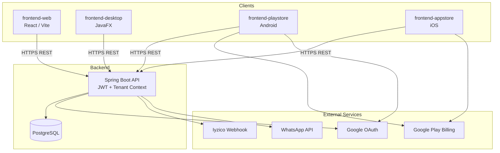

# Pusula Service Ecosystem

**Pusula** is a multi-tenant SaaS platform built for HVAC and field service companies. A single backend powers field operations, inventory and finance management, subscription/plan enforcement, and centralized super-admin tooling.

> **Languages:** English (this file) · [Türkçe](README.tr.md)

| Component | Stack | Description |
|-----------|-------|-------------|
| **Backend API** | Spring Boot 3 · Java 17 · PostgreSQL | REST API, JWT auth, tenant isolation |
| **Web (Marketing)** | React 19 · Vite · Tailwind CSS | Corporate site, support & legal pages |
| **Desktop** | JavaFX 21 · Java 21 | Office / dispatch management (Windows) |
| **Android** | Kotlin · Jetpack Compose · Hilt | Google Play field & admin mobile app |
| **iOS** | SwiftUI · StoreKit | App Store mobile app |

---

## Table of Contents

- [Features](#features)
- [Architecture](#architecture)
- [Repository Structure](#repository-structure)
- [Prerequisites](#prerequisites)
- [Quick Start](#quick-start)
- [Environment Variables](#environment-variables)
- [Database Migrations](#database-migrations)
- [Testing](#testing)
- [Production Deployment](#production-deployment)
- [Security](#security)
- [API Overview](#api-overview)
- [Related Documentation](#related-documentation)

---

## Features

### Operations
- Service tickets (assignment, status tracking, field photos, signatures)
- Barcode scanning for parts and inventory
- Vehicle stock and warehouse inventory
- Proposals and PDF exports
- Customer and current-account management
- Finance reports and admin dashboards

### Platform
- **Multi-tenant architecture:** Each company is data-isolated; tenant context is resolved from JWT automatically.
- **Role-based access:** `SUPER_ADMIN`, `COMPANY_ADMIN`, `TECHNICIAN`, and super-admin sub-roles.
- **Subscriptions & quotas:** Plan-based feature gates and usage limits.
- **Google Play subscription verification:** `POST /api/subscription/google-verify`
- **Payment webhooks:** Iyzico webhook signature validation (optional / future-compatible).
- **Super-admin operations:** Company management, quota status, diagnostic packages, operations dashboard.

### Clients
- **Desktop:** Full operational management with Retrofit-based API integration.
- **Android / iOS:** Field technician and company admin flows, Google / Apple sign-in, in-app purchases.
- **Web:** Public marketing site, contact form, privacy policy.

---

## Architecture



**Authentication flow:** Clients obtain a JWT via `POST /api/auth/login`. Subsequent requests send `Authorization: Bearer <token>`. `TenantInterceptor` extracts the company ID from the token and stores it in `TenantContext`.

---

## Repository Structure

```
Pusula-Service-Ecosystem/
├── backend/                    # Spring Boot REST API
│   ├── src/main/java/          # Controllers, services, entities, DTOs
│   ├── src/main/resources/     # application*.properties, schema.sql, migrations
│   ├── src/test/               # JUnit regression tests
│   ├── deploy_vps_staging.sh   # VPS deployment helper
│   └── .env.example            # Backend env template
├── frontend-web/               # Marketing / corporate website (Vercel)
├── frontend-desktop/           # JavaFX desktop application
├── frontend-playstore/         # Android (Google Play) app
│   └── PusulaService/
├── frontend-appstore/          # iOS (App Store) app
│   └── PusulaService/
├── RUNBOOK.md                  # Production rollout checklist
├── README.md                   # English documentation (this file)
└── README.tr.md                # Turkish documentation
```

> **Note:** The super-admin web panel (`Pusula-Super-Admin-Panel`) lives in a separate repository. See `RUNBOOK.md` for deployment details.

---

## Prerequisites

| Tool | Version | Used for |
|------|---------|----------|
| **Java (JDK)** | 17 | Backend |
| **Java (JDK)** | 21 | Desktop (JavaFX) |
| **Maven** | 3.8+ | Backend & desktop builds |
| **PostgreSQL** | 14+ | Database |
| **Node.js** | 18+ | Web frontend |
| **Android Studio** | Latest | Android development |
| **Xcode** | 15+ | iOS development |

---

## Quick Start

### 1. Backend

```bash
# Create the PostgreSQL database
createdb pusula_db

# Set environment variables (copy the example file)
cp backend/.env.example backend/.env
# Fill in DB_PASSWORD and JWT_SECRET in backend/.env

# Build and run
cd backend
mvn spring-boot:run
```

- **Local port:** `8081` (`application.properties`)
- **VPS profile:** activate with `spring.profiles.active=vps` → uses `application-vps.properties` (port `8080`)
- **Auth endpoints:** `/api/auth/*`

### 2. Web (`frontend-web`)

```bash
cd frontend-web
cp .env.example .env
npm install
npm run dev
```

- **Dev server:** Vite default (`http://localhost:5173`)
- **Production build:** `npm run build` → deploy `dist/` to Vercel or static hosting
- **SPA routing:** configured via `vercel.json` rewrites

### 3. Desktop (`frontend-desktop`)

```bash
cd frontend-desktop
mvn javafx:run
```

Alternatively, run the main class `com.pusula.desktop.Launcher` from your IDE.

- **API base URL:** `RetrofitClient.BASE_URL` (production: `https://api.pusulaiklimlendirme.com/`)
- **Windows installer output:** `frontend-desktop/installer/Output/` (gitignored)

### 4. Android (`frontend-playstore`)

Create `frontend-playstore/PusulaService/local.properties` (**never commit this file**):

```properties
# API
debug.api.base.url=https://api.pusulaiklimlendirme.com
release.api.base.url=https://api.pusulaiklimlendirme.com

# Google Sign-In
google.web.client.id=YOUR_GOOGLE_WEB_CLIENT_ID

# Release signing (required for Play Store uploads)
release.keystore.path=keystore/upload-keystore.jks
release.keystore.password=YOUR_KEYSTORE_PASSWORD
release.key.alias=upload
release.key.password=YOUR_KEY_PASSWORD
```

```bash
cd frontend-playstore/PusulaService
./gradlew assembleDebug        # Debug APK
./gradlew assembleRelease      # Release APK (when signing is configured)
```

- **Application ID:** `com.pusula.service`
- **Min SDK:** 26 · **Target SDK:** 35

### 5. iOS (`frontend-appstore`)

1. Open `frontend-appstore/PusulaService/` in Xcode.
2. API base URL: `Services/NetworkManager.swift`
3. StoreKit integration: `Services/StoreKitManager.swift`
4. Configure signing & capabilities with your Apple Developer account.

---

## Environment Variables

### Backend (production — required)

| Variable | Description |
|----------|-------------|
| `DB_PASSWORD` | PostgreSQL password |
| `JWT_SECRET` | JWT signing secret (64+ characters recommended) |
| `GOOGLE_WEB_CLIENT_ID` | Google OAuth web client ID |
| `GOOGLE_PLAY_PACKAGE_NAME` | Android package name |
| `GOOGLE_PLAY_API_ACCESS_TOKEN` | Google Play Developer API access token |
| `IYZICO_WEBHOOK_SECRET` | Iyzico webhook signature secret |
| `APP_DEPLOY_VERSION` | Deploy version label (e.g. `2026.06.13-1`) |

### Backend (optional)

| Variable | Description |
|----------|-------------|
| `WHATSAPP_API_TOKEN` | WhatsApp notification API token |
| `WHATSAPP_PHONE_ID` | WhatsApp phone number ID |
| `IYZICO_API_KEY` / `IYZICO_API_SECRET` | Iyzico payments (sandbox defaults exist for dev) |
| `APP_BUSINESS_TIMEZONE` | Business timezone (default: `Europe/Istanbul`) |

Templates: `backend/.env.example`, `backend/src/main/resources/application.properties`, `backend/src/main/resources/application-vps.properties`

### Web

| Variable | Description |
|----------|-------------|
| `VITE_API_BASE_URL` | Backend API URL |
| `VITE_COMPANY_ID` | Contact form tenant ID |

Template: `frontend-web/.env.example`

---

## Database Migrations

SQL migration files live under `backend/src/main/resources/`:

| File | Description |
|------|-------------|
| `schema.sql` | Base schema definition |
| `V5__backfill_missing_org_codes.sql` | Backfill missing org codes |
| `V6__super_admin_global_tenant_support.sql` | Super-admin global tenant support |

Apply these before production deploys. JPA `ddl-auto=update` auto-updates the schema in dev; use controlled migrations in production.

---

## Testing

```bash
cd backend
mvn test
```

Coverage includes:
- Auth rate limiting
- Payment webhook security
- Google Play verify idempotency
- Super-admin validation & audit
- Feature/quota consistency

---

## Production Deployment

### Backend (VPS)

```bash
export DB_PASSWORD='...'
export JWT_SECRET='...'
export GOOGLE_WEB_CLIENT_ID='...'
# Other production env vars...

cd backend
bash deploy_vps_staging.sh
```

Spring profile: `-Dspring.profiles.active=vps`

### Web (Vercel)

Connect the `frontend-web` directory to Vercel. Build command: `npm run build`, output directory: `dist`.

### Mobile

- **Android:** Release APK/AAB → Google Play Console
- **iOS:** Archive → App Store Connect

For post-deploy smoke tests, see **[`RUNBOOK.md`](RUNBOOK.md)**.

---

## Security

- Never commit JWT secrets, database passwords, or signing keys to the repository.
- `.gitignore` covers: `.env`, `local.properties`, `*.jks`, `keystore/`, `backend/scripts/` (mock data).
- Do not rely on Iyzico sandbox fallback values in production; supply all secrets via environment variables.
- Android HTTP logging uses `SensitiveHttpLogRedactor` to mask tokens and passwords.

---

## API Overview

| Prefix | Description |
|--------|-------------|
| `/api/auth` | Login, register, Google auth |
| `/api/tickets` | Service tickets |
| `/api/inventory` | Inventory management |
| `/api/finance` | Finance operations |
| `/api/admin` | Company admin dashboard |
| `/api/superadmin` | Super-admin operations |
| `/api/subscription` | Subscriptions & Google Play verify |
| `/api/payment` | Payments & webhooks |
| `/api/reports` | Reporting |
| `/api/public` | Unauthenticated public endpoints |

---

## Related Documentation

- [`RUNBOOK.md`](RUNBOOK.md) — Production deploy checklist, smoke test plan, env references
- [`README.tr.md`](README.tr.md) — Turkish documentation

---

## License

This is a private SaaS ecosystem. Distribution and usage rights belong to the project owner.

## Contact

- **Website:** [pusulaiklimlendirme.com](https://pusulaiklimlendirme.com)
- **Email:** pusulaiklimlendirme.didim@gmail.com
- **GitHub:** [emirrkls/Pusula-SaaS-Ecosystem](https://github.com/emirrkls/Pusula-SaaS-Ecosystem)
