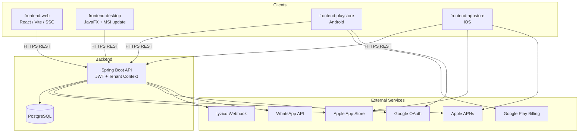

# Pusula Service Ecosystem

**Pusula** is a multi-tenant SaaS platform built for HVAC and field service companies. A single backend powers field operations, inventory and finance management, subscription/plan enforcement, and centralized super-admin tooling.

> **Languages:** English (this file) · [Türkçe](README.tr.md)

| Component | Stack | Description |
|-----------|-------|-------------|
| **Backend API** | Spring Boot 3 · Java 17 · PostgreSQL | REST API, JWT auth, tenant isolation |
| **Web (Marketing)** | React 19 · Vite · Tailwind CSS | Corporate site, local SEO landings, SSG prerender |
| **Desktop** | JavaFX 21 · Java 21 | Office / dispatch management (Windows), MSI auto-update |
| **Android** | Kotlin · Jetpack Compose · Hilt | Google Play field & admin mobile app |
| **iOS** | SwiftUI · StoreKit · APNs | App Store mobile app with push notifications |

---

## Table of Contents

- [Features](#features)
- [Architecture](#architecture)
- [Repository Structure](#repository-structure)
- [Prerequisites](#prerequisites)
- [Quick Start](#quick-start)
- [Environment Variables](#environment-variables)
- [Database Migrations](#database-migrations)
- [Testing](#testing)
- [Production Deployment](#production-deployment)
- [Security](#security)
- [API Overview](#api-overview)
- [Related Documentation](#related-documentation)

---

## Features

### Operations
- Service tickets (assignment, status tracking, field photos, signatures)
- Separate service billing (sale) and collection amounts, including backdated completion
- Barcode scanning for parts and inventory
- Vehicle stock and warehouse inventory
- Proposals and PDF exports
- Customer and current-account management (sale vs collection classification)
- Company debt tracking with dated payments and addition history
- Business asset tracking and valuation reports
- Finance reports: profitability vs cash-flow, open-debt / current-account exports, monthly PDF reports
- Admin dashboards (KPI, technician performance, quota, field radar)

### Platform
- **Multi-tenant architecture:** Each company is data-isolated; tenant context is resolved from JWT automatically (including vehicle and inventory mutation isolation).
- **Role-based access:** `SUPER_ADMIN`, `COMPANY_ADMIN`, `TECHNICIAN`, and super-admin sub-roles.
- **Subscriptions & quotas:** Plan-based feature gates and usage limits.
- **Google Play subscription verification:** `POST /api/subscription/google-verify`
- **App Store subscription verification:** `POST /api/subscription/apple-verify`
- **iOS APNs push:** Ticket assignment notifications via registered push devices (`/api/push-devices`)
- **Payment webhooks:** Iyzico webhook signature validation (optional / future-compatible).
- **Super-admin operations:** Company management, quota status, diagnostic packages, operations dashboard.

### Clients
- **Desktop:** Full operational management with Retrofit-based API integration, modern UI / dark theme, finance & business-assets tabs, MSI auto-update (version from `frontend-desktop/src/main/resources/app-version.properties`).
- **Android / iOS:** Field technician and company admin flows, Google / Apple sign-in, in-app purchases (Play Billing / StoreKit).
- **Web:** Public marketing site with local SEO landing pages, price list, authorized brands, contact form, privacy/terms, and SSG prerender for public routes.

---

## Architecture


```mermaid
flowchart TB
    subgraph clients [Clients]
        WEB[frontend-web<br/>React / Vite / SSG]
        DESK[frontend-desktop<br/>JavaFX + MSI update]
        AND[frontend-playstore<br/>Android]
        IOS[frontend-appstore<br/>iOS]
    end

    subgraph backend [Backend]
        API[Spring Boot API<br/>JWT + Tenant Context]
        DB[(PostgreSQL)]
    end

    subgraph external [External Services]
        GP[Google Play Billing]
        AS[Apple App Store]
        APNS[Apple APNs]
        GAuth[Google OAuth]
        IYZ[Iyzico Webhook]
        WA[WhatsApp API]
    end

    WEB -->|HTTPS REST| API
    DESK -->|HTTPS REST| API
    AND -->|HTTPS REST| API
    IOS -->|HTTPS REST| API

    API --> DB
    AND --> GP
    IOS --> AS
    IOS --> APNS
    API --> AS
    API --> APNS
    AND --> GAuth
    API --> GAuth
    API --> IYZ
    API --> WA
```

**Authentication flow:** Clients obtain a JWT via `POST /api/auth/login`. Subsequent requests send `Authorization: Bearer <token>`. `TenantInterceptor` extracts the company ID from the token and stores it in `TenantContext`.

---

## Repository Structure

```
Pusula-SaaS-Ecosystem/
├── backend/                    # Spring Boot REST API
│   ├── src/main/java/          # Controllers, services, entities, DTOs
│   ├── src/main/resources/     # application*.properties, schema.sql, V2–V18 migrations
│   ├── src/test/               # JUnit regression tests
│   ├── deploy_vps_staging.sh   # VPS deployment helper
│   └── .env.example            # Backend env template
├── frontend-web/               # Marketing / corporate website (Vercel + SSG)
├── frontend-desktop/           # JavaFX desktop application (Windows / MSI)
├── frontend-playstore/         # Android (Google Play) app
│   └── PusulaService/
├── frontend-appstore/          # iOS (App Store) app
│   └── PusulaService/
├── scripts/                    # Helper scripts (e.g. Play Store assets)
├── RUNBOOK.md                  # Production rollout checklist
├── README.md                   # English documentation (this file)
└── README.tr.md                # Turkish documentation
```

> **Note:** The super-admin web panel (`Pusula-Super-Admin-Panel`) lives in a separate repository. See `RUNBOOK.md` for deployment details.

---

## Prerequisites

| Tool | Version | Used for |
|------|---------|----------|
| **Java (JDK)** | 17 | Backend |
| **Java (JDK)** | 21 | Desktop (JavaFX) |
| **Maven** | 3.8+ | Backend & desktop builds |
| **PostgreSQL** | 14+ | Database |
| **Node.js** | 18+ | Web frontend |
| **Android Studio** | Latest | Android development |
| **Xcode** | 15+ | iOS development |

---

## Quick Start

### 1. Backend

```bash
# Create the PostgreSQL database
createdb pusula_db

# Set environment variables (copy the example file)
cp backend/.env.example backend/.env
# Fill in DB_PASSWORD and JWT_SECRET in backend/.env

# Build and run
cd backend
mvn spring-boot:run
```

- **Local port:** `8081` (`application.properties`)
- **VPS profile:** activate with `spring.profiles.active=vps` → uses `application-vps.properties` (port `8080`)
- **Auth endpoints:** `/api/auth/*`

### 2. Web (`frontend-web`)

```bash
cd frontend-web
cp .env.example .env
npm install
npm run dev
```

- **Dev server:** Vite default (`http://localhost:5173`)
- **Production build:** `npm run build` runs Vite client build, SSR build, then `scripts/prerender.mjs` (SSG for public routes) → deploy `dist/` to Vercel or static hosting
- **SPA routing:** configured via `vercel.json` rewrites

### 3. Desktop (`frontend-desktop`)

```bash
cd frontend-desktop
mvn javafx:run
```

Alternatively, run the main class `com.pusula.desktop.Launcher` from your IDE.

- **API base URL:** `RetrofitClient.BASE_URL` (production: `https://api.pusulaiklimlendirme.com/`)
- **App version:** `frontend-desktop/src/main/resources/app-version.properties`
- **Auto-update:** desktop checks `/api/public/desktop-version` and applies MSI updates
- **Windows installer output:** `frontend-desktop/installer/Output/` (gitignored)

### 4. Android (`frontend-playstore`)

Create `frontend-playstore/PusulaService/local.properties` (**never commit this file**):

```properties
# API
debug.api.base.url=https://api.pusulaiklimlendirme.com
release.api.base.url=https://api.pusulaiklimlendirme.com

# Google Sign-In
google.web.client.id=YOUR_GOOGLE_WEB_CLIENT_ID

# Release signing (required for Play Store uploads)
release.keystore.path=keystore/upload-keystore.jks
release.keystore.password=YOUR_KEYSTORE_PASSWORD
release.key.alias=upload
release.key.password=YOUR_KEY_PASSWORD
```

```bash
cd frontend-playstore/PusulaService
./gradlew assembleDebug        # Debug APK
./gradlew assembleRelease      # Release APK (when signing is configured)
```

- **Application ID:** `com.pusula.service`
- **Min SDK:** 26 · **Target SDK:** 35

### 5. iOS (`frontend-appstore`)

1. Open `frontend-appstore/PusulaService/` in Xcode (`PusulaService.xcodeproj`).
2. API base URL: `Services/NetworkManager.swift`
3. StoreKit integration: `Services/StoreKitManager.swift`
4. Push notifications: enable the **Push Notifications (APNs)** capability; client registration uses `/api/push-devices`.
5. Configure signing & capabilities with your Apple Developer account.
6. For device testing notes, see `frontend-appstore/REAL_DEVICE_TEST_PLAN.md`.

---

## Environment Variables

### Backend (production — required)

| Variable | Description |
|----------|-------------|
| `DB_PASSWORD` | PostgreSQL password |
| `JWT_SECRET` | JWT signing secret (64+ characters recommended) |
| `GOOGLE_WEB_CLIENT_ID` | Google OAuth web client ID |
| `GOOGLE_PLAY_PACKAGE_NAME` | Android package name |
| `GOOGLE_PLAY_API_ACCESS_TOKEN` | Google Play Developer API access token |
| `IYZICO_WEBHOOK_SECRET` | Iyzico webhook signature secret |
| `APP_DEPLOY_VERSION` | Deploy version label (e.g. `2026.06.13-1`) |

### Backend — App Store & APNs

| Variable | Description |
|----------|-------------|
| `APPLE_APP_STORE_BUNDLE_ID` | App Store bundle ID (default: `com.pusula.service`) |
| `APPLE_APP_STORE_APP_APPLE_ID` | Numeric App Store app Apple ID |
| `APPLE_APP_STORE_ENVIRONMENTS` | Verification environments (default: `SANDBOX,PRODUCTION`) |
| `APPLE_APP_STORE_ROOT_CERTIFICATE_PATHS` | Paths to Apple root certificates (comma-separated) |
| `APPLE_APP_STORE_ENABLE_ONLINE_CHECKS` | Enable online App Store checks (default: `true`) |
| `APPLE_PUSH_ENABLED` | Enable APNs push delivery (default: `false`) |
| `APPLE_PUSH_KEY_PATH` | Path to APNs `.p8` auth key |
| `APPLE_PUSH_KEY_ID` | APNs key ID |
| `APPLE_PUSH_TEAM_ID` | Apple Developer Team ID |
| `APPLE_PUSH_BUNDLE_ID` | Push topic / bundle ID (default: `com.pusula.service`) |
| `PUSH_TOKEN_ENCRYPTION_KEY` | Base64-encoded 32-byte AES key for push token encryption |

### Backend (optional)

| Variable | Description |
|----------|-------------|
| `WHATSAPP_API_TOKEN` | WhatsApp notification API token |
| `WHATSAPP_PHONE_ID` | WhatsApp phone number ID |
| `IYZICO_API_KEY` / `IYZICO_API_SECRET` | Iyzico payments (sandbox defaults exist for dev) |
| `IYZICO_BASE_URL` / `IYZICO_CALLBACK_URL` | Iyzico API base and webhook callback URL |
| `APP_BUSINESS_TIMEZONE` | Business timezone (default: `Europe/Istanbul`) |

Templates: `backend/.env.example`, `backend/src/main/resources/application.properties`, `backend/src/main/resources/application-vps.properties`

### Web

| Variable | Description |
|----------|-------------|
| `VITE_API_BASE_URL` | Backend API URL |
| `VITE_COMPANY_ID` | Contact form tenant ID |

Template: `frontend-web/.env.example`

---

## Database Migrations

SQL migration files live under `backend/src/main/resources/`:

| File | Description |
|------|-------------|
| `schema.sql` | Base schema definition |
| `V2__saas_plans_and_features.sql` | SaaS plans, features, and usage tracking |
| `V3__inventory_barcode.sql` | Inventory barcode column |
| `V4__production_readiness.sql` | Read-only expired subscriptions, plan seeds, indexes |
| `V5__backfill_missing_org_codes.sql` | Backfill missing org codes |
| `V6__super_admin_global_tenant_support.sql` | Super-admin global tenant support |
| `V7__app_store_subscription_verification.sql` | App Store subscription verification / ownership hashes |
| `V8__ios_apns_push_devices.sql` | iOS APNs push device registration table |
| `V9__service_ticket_completion_and_collection_dates.sql` | Completion and collection business dates |
| `V10__ticket_pricing_and_cost_snapshots.sql` | Sale vs collection pricing snapshots on tickets |
| `V11__service_expense_business_dates.sql` | Service expense business dates and finance link |
| `V12__company_debt_payment_history.sql` | Company debt payment history |
| `V13__current_account_payment_classification.sql` | Current-account collection classification |
| `V14__expense_financial_treatment.sql` | Expense financial treatment (e.g. operating vs other) |
| `V15__company_debt_addition_history.sql` | Company debt addition history |
| `V16__current_account_optimistic_lock.sql` | Optimistic locking on current accounts |
| `V17__inventory_critical_level_not_null.sql` | Inventory critical level NOT NULL |
| `V18__business_assets.sql` | Business assets tracking |

Apply these before production deploys. JPA `ddl-auto=update` auto-updates the schema in dev; use controlled migrations in production.

Manual helper scripts (not part of the numbered sequence) live under `backend/src/main/resources/db/manual/`.

---

## Testing

```bash
cd backend
mvn test
```

Coverage includes:
- Auth rate limiting and JWT handling
- Payment webhook security and provider isolation
- Google Play / App Store verify idempotency and renewals
- APNs push listener / device registration behavior
- Super-admin validation & audit
- Feature/quota consistency
- Tenant isolation (e.g. vehicles) and inventory mutation security
- Finance / report semantics (pricing snapshots, current-account classification, open balances)

---

## Production Deployment

### Backend (VPS)

```bash
export DB_PASSWORD='...'
export JWT_SECRET='...'
export GOOGLE_WEB_CLIENT_ID='...'
# Other production env vars (Play, App Store, APNs, Iyzico)...

cd backend
bash deploy_vps_staging.sh
```

Spring profile: `-Dspring.profiles.active=vps`

### Web (Vercel)

Connect the `frontend-web` directory to Vercel. Build command: `npm run build` (includes SSG prerender), output directory: `dist`.

### Mobile

- **Android:** Release APK/AAB → Google Play Console
- **iOS:** Archive → App Store Connect (ensure APNs key and App Store Server verification env are configured on the API)

For post-deploy smoke tests, see **[`RUNBOOK.md`](RUNBOOK.md)**.

---

## Security

- Never commit JWT secrets, database passwords, APNs keys, or signing keys to the repository.
- `.gitignore` covers: `.env`, `local.properties`, `*.jks`, `keystore/`, `backend/scripts/` (mock data).
- Do not rely on Iyzico sandbox fallback values in production; supply all secrets via environment variables.
- Push device tokens are encrypted at rest when `PUSH_TOKEN_ENCRYPTION_KEY` is configured.
- Android HTTP logging uses `SensitiveHttpLogRedactor` to mask tokens and passwords.
- Inventory mutations and vehicle access are tenant-scoped on the backend.

---

## API Overview

| Prefix | Description |
|--------|-------------|
| `/api/auth` | Login, register, Google auth |
| `/api/tickets` | Service tickets (including complete / signature) |
| `/api/inventory` | Inventory management |
| `/api/finance` | Finance operations |
| `/api/current-accounts` | Current-account management |
| `/api/company-debts` | Company debt tracking |
| `/api/business-assets` | Business asset tracking |
| `/api/admin` | Company admin dashboard |
| `/api/superadmin` | Super-admin operations |
| `/api/subscription` | Plans, Google Play verify, App Store verify |
| `/api/payment` | Payments & webhooks |
| `/api/push-devices` | Mobile push device registration (APNs) |
| `/api/reports` | Reporting (profitability, cash flow, open debt, etc.) |
| `/api/public` | Unauthenticated public endpoints |
| `/api/public/desktop-version` | Desktop MSI auto-update version check |

---

## Related Documentation

- [`RUNBOOK.md`](RUNBOOK.md) — Production deploy checklist, smoke test plan, env references
- [`README.tr.md`](README.tr.md) — Turkish documentation
- [`frontend-appstore/REAL_DEVICE_TEST_PLAN.md`](frontend-appstore/REAL_DEVICE_TEST_PLAN.md) — iOS real-device test plan
- [`scripts/`](scripts/) — Play Store asset generation helpers

---

## License

This is a private SaaS ecosystem. Distribution and usage rights belong to the project owner.

## Contact

- **Website:** [pusulaiklimlendirme.com](https://pusulaiklimlendirme.com)
- **Email:** pusulaiklimlendirme.didim@gmail.com
- **GitHub:** [emirrkls/Pusula-SaaS-Ecosystem](https://github.com/emirrkls/Pusula-SaaS-Ecosystem)
