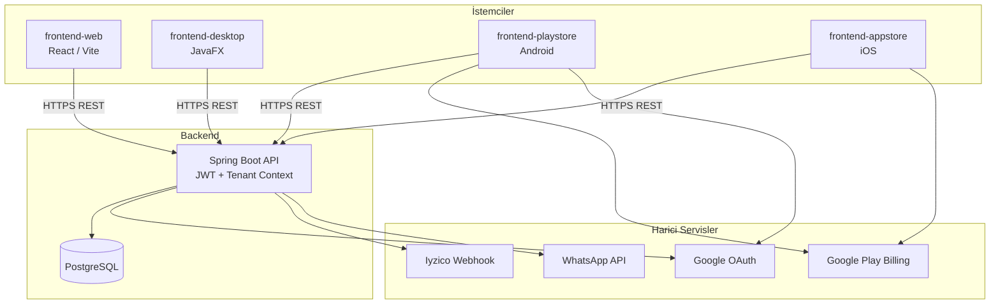

# Pusula Service Ecosystem

**Pusula**, iklimlendirme ve teknik servis firmaları için geliştirilmiş, çok kiracılı (multi-tenant) bir SaaS platformudur. Tek bir backend üzerinden saha operasyonları, stok ve finans yönetimi, abonelik/plan kontrolü ve merkezi super-admin operasyonlarını bir arada sunar.

> **Diller:** [English](README.md) · Türkçe (bu dosya)

| Bileşen | Teknoloji | Açıklama |
|---------|-----------|----------|
| **Backend API** | Spring Boot 3 · Java 17 · PostgreSQL | REST API, JWT auth, tenant izolasyonu |
| **Web (Marketing)** | React 19 · Vite · Tailwind CSS | Kurumsal web sitesi, destek ve yasal sayfalar |
| **Desktop** | JavaFX 21 · Java 21 | Ofis / dispatch yönetim uygulaması (Windows) |
| **Android** | Kotlin · Jetpack Compose · Hilt | Google Play saha ve admin mobil uygulaması |
| **iOS** | SwiftUI · StoreKit | App Store mobil uygulaması |

---

## İçindekiler

- [Özellikler](#özellikler)
- [Mimari](#mimari)
- [Depo Yapısı](#depo-yapısı)
- [Gereksinimler](#gereksinimler)
- [Hızlı Başlangıç](#hızlı-başlangıç)
- [Ortam Değişkenleri](#ortam-değişkenleri)
- [Veritabanı Migrasyonları](#veritabanı-migrasyonları)
- [Testler](#testler)
- [Production Dağıtımı](#production-dağıtımı)
- [Güvenlik](#güvenlik)
- [API Özeti](#api-özeti)
- [İlgili Dokümantasyon](#ilgili-dokümantasyon)

---

## Özellikler

### Operasyonel
- Servis iş emirleri (atama, durum takibi, saha fotoğrafları, imza)
- Barkod ile stok / parça okuma
- Araç stoğu ve envanter yönetimi
- Teklif (proposal) oluşturma ve PDF çıktıları
- Müşteri ve cari hesap yönetimi
- Finans raporları ve admin dashboard

### Platform
- **Multi-tenant mimari:** Her şirket (`company`) kendi verisiyle izole çalışır; JWT üzerinden tenant context otomatik set edilir.
- **Rol tabanlı erişim:** `SUPER_ADMIN`, `COMPANY_ADMIN`, `TECHNICIAN` ve super-admin alt rolleri.
- **Abonelik & kota:** Plan bazlı özellik kapıları (feature gate) ve kullanım kotaları.
- **Google Play abonelik doğrulama:** `POST /api/subscription/google-verify`
- **Ödeme webhook altyapısı:** Iyzico webhook imza doğrulama (opsiyonel / gelecek uyumlu).
- **Super-admin operasyon paneli:** Şirket yönetimi, kota durumu, diagnostic paketleri, operations dashboard.

### İstemciler
- **Desktop:** Tam operasyon yönetimi, Retrofit tabanlı API entegrasyonu.
- **Android / iOS:** Saha teknisyeni ve şirket admin akışları, Google / Apple oturum açma, in-app purchase.
- **Web:** Halka açık tanıtım sitesi, iletişim formu, gizlilik politikası.

---

## Mimari



**Kimlik doğrulama akışı:** İstemci `POST /api/auth/login` ile JWT alır. Sonraki isteklerde `Authorization: Bearer <token>` header'ı kullanılır. `TenantInterceptor`, token'dan company ID'yi çıkarıp `TenantContext`'e yazar.

---

## Depo Yapısı

```
Pusula-Service-Ecosystem/
├── backend/                    # Spring Boot REST API
│   ├── src/main/java/          # Controller, service, entity, DTO
│   ├── src/main/resources/     # application*.properties, schema.sql, migrations
│   ├── src/test/               # JUnit regression testleri
│   ├── deploy_vps_staging.sh   # VPS deployment helper
│   └── .env.example            # Backend env şablonu
├── frontend-web/               # Marketing / kurumsal web sitesi (Vercel)
├── frontend-desktop/           # JavaFX masaüstü uygulaması
├── frontend-playstore/         # Android (Google Play) uygulaması
│   └── PusulaService/
├── frontend-appstore/          # iOS (App Store) uygulaması
│   └── PusulaService/
├── RUNBOOK.md                  # Production rollout checklist
├── README.md                   # İngilizce dokümantasyon
└── README.tr.md                # Türkçe dokümantasyon (bu dosya)
```

> **Not:** Super-admin web paneli (`Pusula-Super-Admin-Panel`) bu depoda değil; ayrı bir proje olarak yönetilir. Detaylar için `RUNBOOK.md` dosyasına bakın.

---

## Gereksinimler

| Araç | Sürüm | Kullanım |
|------|-------|----------|
| **Java (JDK)** | 17 | Backend |
| **Java (JDK)** | 21 | Desktop (JavaFX) |
| **Maven** | 3.8+ | Backend & Desktop build |
| **PostgreSQL** | 14+ | Veritabanı |
| **Node.js** | 18+ | Web frontend |
| **Android Studio** | Latest | Android geliştirme |
| **Xcode** | 15+ | iOS geliştirme |

---

## Hızlı Başlangıç

### 1. Backend

```bash
# PostgreSQL'de veritabanı oluşturun
createdb pusula_db

# Ortam değişkenlerini ayarlayın (örnek dosyayı kopyalayın)
cp backend/.env.example backend/.env
# backend/.env içinde DB_PASSWORD ve JWT_SECRET değerlerini doldurun

# Derleme ve çalıştırma
cd backend
mvn spring-boot:run
```

- **Local port:** `8081` (`application.properties`)
- **VPS profili:** `spring.profiles.active=vps` ile `application-vps.properties` devreye girer (port `8080`)
- **Auth endpoint'leri:** `/api/auth/*`

### 2. Web Sitesi (`frontend-web`)

```bash
cd frontend-web
cp .env.example .env
npm install
npm run dev
```

- **Dev server:** Vite default (`http://localhost:5173`)
- **Production build:** `npm run build` → Vercel veya statik hosting
- **SPA routing:** `vercel.json` rewrite kuralları ile yapılandırılmıştır

### 3. Desktop Uygulaması (`frontend-desktop`)

```bash
cd frontend-desktop
mvn javafx:run
```

Alternatif olarak IDE'den `com.pusula.desktop.Launcher` main class'ını çalıştırın.

- **API base URL:** `RetrofitClient.BASE_URL` (production: `https://api.pusulaiklimlendirme.com/`)
- **Windows installer çıktıları:** `frontend-desktop/installer/Output/` (gitignore'da)

### 4. Android Uygulaması (`frontend-playstore`)

`frontend-playstore/PusulaService/local.properties` dosyasını oluşturun (**bu dosya repoya commit edilmez**):

```properties
# API
debug.api.base.url=https://api.pusulaiklimlendirme.com
release.api.base.url=https://api.pusulaiklimlendirme.com

# Google Sign-In
google.web.client.id=YOUR_GOOGLE_WEB_CLIENT_ID

# Release imzalama (Play Store yükleme için)
release.keystore.path=keystore/upload-keystore.jks
release.keystore.password=YOUR_KEYSTORE_PASSWORD
release.key.alias=upload
release.key.password=YOUR_KEY_PASSWORD
```

```bash
cd frontend-playstore/PusulaService
./gradlew assembleDebug        # Debug APK
./gradlew assembleRelease      # Release APK (imzalama yapılandırılmışsa)
```

- **Application ID:** `com.pusula.service`
- **Min SDK:** 26 · **Target SDK:** 35

### 5. iOS Uygulaması (`frontend-appstore`)

1. `frontend-appstore/PusulaService/` dizinini Xcode ile açın.
2. API base URL: `Services/NetworkManager.swift`
3. StoreKit entegrasyonu: `Services/StoreKitManager.swift`
4. Signing & capabilities'i Apple Developer hesabınızla yapılandırın.

---

## Ortam Değişkenleri

### Backend (Production — zorunlu)

| Değişken | Açıklama |
|----------|----------|
| `DB_PASSWORD` | PostgreSQL şifresi |
| `JWT_SECRET` | JWT imzalama anahtarı (64+ karakter önerilir) |
| `GOOGLE_WEB_CLIENT_ID` | Google OAuth web client ID |
| `GOOGLE_PLAY_PACKAGE_NAME` | Android paket adı |
| `GOOGLE_PLAY_API_ACCESS_TOKEN` | Google Play Developer API erişim token'ı |
| `IYZICO_WEBHOOK_SECRET` | Iyzico webhook imza doğrulama |
| `APP_DEPLOY_VERSION` | Deploy sürüm etiketi (ör. `2026.06.13-1`) |

### Backend (Opsiyonel)

| Değişken | Açıklama |
|----------|----------|
| `WHATSAPP_API_TOKEN` | WhatsApp bildirim API token |
| `WHATSAPP_PHONE_ID` | WhatsApp phone number ID |
| `IYZICO_API_KEY` / `IYZICO_API_SECRET` | Iyzico ödeme (sandbox varsayılanları dev için) |
| `APP_BUSINESS_TIMEZONE` | İş saatleri timezone (varsayılan: `Europe/Istanbul`) |

Şablon dosyalar: `backend/.env.example`, `backend/src/main/resources/application.properties`, `backend/src/main/resources/application-vps.properties`

### Web

| Değişken | Açıklama |
|----------|----------|
| `VITE_API_BASE_URL` | Backend API URL |
| `VITE_COMPANY_ID` | İletişim formu tenant ID |

Şablon: `frontend-web/.env.example`

---

## Veritabanı Migrasyonları

SQL migration dosyaları `backend/src/main/resources/` altında:

| Dosya | Açıklama |
|-------|----------|
| `schema.sql` | Temel şema tanımı |
| `V5__backfill_missing_org_codes.sql` | Eksik org code backfill |
| `V6__super_admin_global_tenant_support.sql` | Super-admin global tenant desteği |

Production'da deploy öncesi bu dosyaların uygulandığından emin olun. JPA `ddl-auto=update` dev ortamında şemayı otomatik günceller; production'da kontrollü migration tercih edilmelidir.

---

## Testler

```bash
cd backend
mvn test
```

Kapsanan alanlar:
- Auth rate limiting
- Payment webhook güvenliği
- Google Play verify idempotency
- Super-admin validation & audit
- Feature/quota tutarlılığı

---

## Production Dağıtımı

### Backend (VPS)

```bash
export DB_PASSWORD='...'
export JWT_SECRET='...'
export GOOGLE_WEB_CLIENT_ID='...'
# Diğer production env'ler...

cd backend
bash deploy_vps_staging.sh
```

Spring profili: `-Dspring.profiles.active=vps`

### Web (Vercel)

`frontend-web` dizinini Vercel'e bağlayın. Build command: `npm run build`, output: `dist`.

### Mobil

- **Android:** Release APK/AAB → Google Play Console
- **iOS:** Archive → App Store Connect

Deploy sonrası smoke test planı için **[`RUNBOOK.md`](RUNBOOK.md)** dosyasına bakın.

---

## Güvenlik

- JWT secret, DB şifresi ve imzalama anahtarları **asla** repoya commit edilmemelidir.
- `.gitignore` kapsamı: `.env`, `local.properties`, `*.jks`, `keystore/`, `backend/scripts/` (mock data).
- Production'da sandbox Iyzico fallback değerlerine güvenmeyin; tüm secret'ları env üzerinden sağlayın.
- Android HTTP log'larında `SensitiveHttpLogRedactor` token ve şifre alanlarını maskeler.

---

## API Özeti

| Prefix | Açıklama |
|--------|----------|
| `/api/auth` | Login, register, Google auth |
| `/api/tickets` | Servis iş emirleri |
| `/api/inventory` | Stok yönetimi |
| `/api/finance` | Finans işlemleri |
| `/api/admin` | Şirket admin dashboard |
| `/api/superadmin` | Super-admin operasyonları |
| `/api/subscription` | Abonelik & Google Play verify |
| `/api/payment` | Ödeme & webhook |
| `/api/reports` | Raporlama |
| `/api/public` | Kimlik doğrulama gerektirmeyen endpoint'ler |

---

## İlgili Dokümantasyon

- [`README.md`](README.md) — English documentation
- [`RUNBOOK.md`](RUNBOOK.md) — Production deploy checklist, smoke test planı, env referansları

---

## Lisans

Bu proje özel (private) bir SaaS ekosistemidir. Dağıtım ve kullanım hakları proje sahibine aittir.

## İletişim

- **Web:** [pusulaiklimlendirme.com](https://pusulaiklimlendirme.com)
- **E-posta:** pusulaiklimlendirme.didim@gmail.com
- **GitHub:** [emirrkls/Pusula-SaaS-Ecosystem](https://github.com/emirrkls/Pusula-SaaS-Ecosystem)
