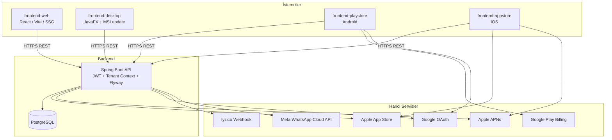

# Pusula Service Ecosystem

**Pusula**, iklimlendirme ve saha servis firmaları için geliştirilmiş çok kiracılı (multi-tenant) bir SaaS platformudur. Ortak backend; iş emri yönetimi, saha operasyonları, stok, finans, raporlama, abonelik, bildirim ve isteğe bağlı servis ağı özelliklerini sunarken her işletmenin operasyonel verisini birbirinden izole eder.

> **Diller:** [English](README.md) · Türkçe (bu dosya)

| Bileşen | Teknoloji | Açıklama |
|---------|-----------|----------|
| **Backend API** | Spring Boot 3 · Java 17 · PostgreSQL | REST API, JWT auth, tenant izolasyonu |
| **Web (Marketing)** | React 19 · Vite · Tailwind CSS | Kurumsal site, yerel SEO landing’ler, SSG prerender |
| **Desktop** | JavaFX 21 · Java 21 | Ofis / dispatch yönetimi (Windows), MSI otomatik güncelleme |
| **Android** | Kotlin · Jetpack Compose · Hilt | Google Play saha ve admin mobil uygulaması |
| **iOS** | SwiftUI · StoreKit · APNs | App Store mobil uygulaması, push bildirimleri |

---

## İçindekiler

- [Özellikler](#özellikler)
- [Mimari](#mimari)
- [Servis Ağı İşleyişi](#servis-ağı-işleyişi)
- [Depo Yapısı](#depo-yapısı)
- [Gereksinimler](#gereksinimler)
- [Hızlı Başlangıç](#hızlı-başlangıç)
- [Ortam Değişkenleri](#ortam-değişkenleri)
- [Veritabanı Migrasyonları](#veritabanı-migrasyonları)
- [Testler](#testler)
- [Production Dağıtımı](#production-dağıtımı)
- [Güvenlik](#güvenlik)
- [API Özeti](#api-özeti)
- [İlgili Dokümantasyon](#ilgili-dokümantasyon)

---

## Özellikler

### Operasyonel
- Müşteri/teknisyen araması, saat aralığı, teknisyene özel not, durum takibi, kontrollü yeniden planlama, yeniden açma, imza ve geçmiş tarihli kapatma destekli servis fişleri
- Servis satışı, işçilik, tahsilat, cari aktarım, doğrudan maliyet ve dış giderlerin ayrı finansal anlamlarla işlenmesi
- Barkod, araç stoğu, kesirli ürün miktarı, işe özel satış fiyatı, kritik stok uyarısı ve idempotent parça kullanımı destekli envanter
- Küçük resim, kategori, not, kamera/galeri, indirme ve fiş/müşteri/tarih bağlamı bulunan aranabilir Servis Görselleri arşivi
- Stoktan kalem seçimi, müşteri araması, durum kategorileri, PDF ve işe dönüştürme destekli teklifler
- İşlem geçmişli cari hesaplar; tarihli ilave ve kısmi/tam ödeme geçmişli işletme borçları
- Takım/demirbaş ve envanter değerleme PDF'leri
- Aylık kârlılık, açık cari/borç görünümü ve operasyon dashboard'ları
- Uygulama içi admin bildirim merkezi ve ilgili servis olayları için mobil push bildirimleri

### Platform
- **Multi-tenant mimari:** Her şirket (`company`) kendi verisiyle izole çalışır; JWT üzerinden tenant context otomatik set edilir (araç ve stok mutasyon izolasyonu dahil).
- **Rol tabanlı erişim:** `SUPER_ADMIN`, `COMPANY_ADMIN`, `TECHNICIAN` ve super-admin alt rolleri.
- **Abonelik & kota:** Ücretsiz, Usta ve Patron paketleri için merkezi tanımlanan yetenekler ve kullanım sınırları.
- **İsteğe bağlı servis ağı:** Yetkilendirilmiş üst işletme, veri izolasyonunu bozmadan alt işletme oluşturabilir veya davet edebilir; iş emri gönderip kabul, ret, iptal, not ve yaşam döngüsü güncellemelerini izleyebilir.
- **Google Play abonelik doğrulama:** `POST /api/subscription/google-verify`
- **App Store abonelik doğrulama:** `POST /api/subscription/apple-verify`
- **Zaman pencereli APNs push:** Bugün/önümüzdeki 24 saatteki işler bildirilir; daha ileri işler pencereye girdiğinde gönderilir.
- **İşletme kapsamlı WhatsApp bildirimi:** Yalnızca açıkça izin verilen işletmeler için onaylı şablonlarla servis açılış/tamamlanma mesajları.
- **Ödeme webhook altyapısı:** Iyzico webhook imza doğrulama (opsiyonel / gelecek uyumlu).
- **Super-admin operasyon paneli:** Şirket yönetimi, kota durumu, diagnostic paketleri, operations dashboard.

### İstemciler
- **Desktop:** Tam ofis/sevk yönetimi, modern ve uyarlanabilir pencereler, finans/demirbaş araçları, servis görsel tarayıcısı, servis ağı yönetimi, PDF raporları ve doğrulanan MSI güncellemesi.
- **Android / iOS:** Teknisyen ve şirket admin akışları, onboarding, müşteri/stok arama, servis medyası, kontrollü yeniden planlama, bildirimler, Google/Apple oturumu ve Play Billing/StoreKit desteği.
- **Web:** Halka açık tanıtım sitesi; yerel SEO landing sayfaları, fiyat listesi, yetkili markalar, iletişim formu, gizlilik/şartlar ve public route’lar için SSG prerender.

---

## Mimari


```mermaid
flowchart TB
    subgraph clients [İstemciler]
        WEB[frontend-web<br/>React / Vite / SSG]
        DESK[frontend-desktop<br/>JavaFX + MSI update]
        AND[frontend-playstore<br/>Android]
        IOS[frontend-appstore<br/>iOS]
    end

    subgraph backend [Backend]
        API[Spring Boot API<br/>JWT + Tenant Context + Flyway]
        DB[(PostgreSQL)]
    end

    subgraph external [Harici Servisler]
        GP[Google Play Billing]
        AS[Apple App Store]
        APNS[Apple APNs]
        GAuth[Google OAuth]
        IYZ[Iyzico Webhook]
        WA[Meta WhatsApp Cloud API]
    end

    WEB -->|HTTPS REST| API
    DESK -->|HTTPS REST| API
    AND -->|HTTPS REST| API
    IOS -->|HTTPS REST| API

    API --> DB
    AND --> GP
    IOS --> AS
    IOS --> APNS
    API --> AS
    API --> APNS
    AND --> GAuth
    API --> GAuth
    API --> IYZ
    API --> WA
```

**Kimlik doğrulama akışı:** İstemci `/api/auth/authenticate` (veya desteklenen kimlik sağlayıcı akışı) üzerinden JWT alır. Sonraki isteklerde `Authorization: Bearer <token>` header'ı kullanılır. `TenantInterceptor` işletme bağlamını çözer; repository ve servis katmanları şirket sahipliğini ayrıca doğrular. İstemcinin başka bir tenant seçmesine güvenilmez.

**Servis ağı sınırı:** Üst ve alt işletmeler ayrı tenant olarak kalır. Ağ tabloları üst/alt işletme kimliklerini ve değişmez isim anlık görüntülerini taşır. Alt işletmenin ağ işini kabul etmesi kendi tenant'ında normal servis fişi oluşturur; taraflardan hiçbirine diğer işletmenin müşterilerine, stoklarına, finansına, kullanıcılarına veya diğer fişlerine erişim vermez.

---

## Servis Ağı İşleyişi

Servis ağı isteğe bağlıdır ve normal abonelik paketi erişiminden ayrıdır. Super-admin üst işletme için politikayı açar; azami alt servis ve aylık ağ iş emri limitlerini belirler.

1. Üst işletmenin şirket yöneticisi ayrı tenant ve şirket-admin hesabıyla yeni alt servis oluşturur veya mevcut işletmeyi organizasyon koduyla davet eder.
2. Mevcut işletme daveti kabul etmelidir; yeni oluşturulan alt servis doğrudan bağlanır ve tanımlı deneme davranışıyla başlar.
3. Üst işletme müşteri iletişim/adres bilgileri ve teknisyene özel talimatla tarihli ağ iş emri gönderir.
4. Alt servis işi kabul eder; isterse mevcut müşterisini ve teknisyenini seçer ve kendi işletmesinde normal servis fişi oluşur. Bekleyen iş alt servis tarafından reddedilebilir veya üst işletme tarafından geri çekilebilir.
5. Notlar ve fiş yaşam döngüsü ağ işi geçmişinden izlenir. Bekleyen veya sonuçlanmamış iş varken servis ağı bağlantısı kapatılamaz.

Ağ API'sini yalnızca şirket yöneticileri ve super-admin kullanabilir. Alt servis ikinci kademe ağ açamaz. Alt işletme ve iş oluşturma istekleri idempotency anahtarı kullanır; güvenli tekrar denemeler işletme, hesap veya iş emrini çoğaltmaz.

---

## Depo Yapısı

```
Pusula-SaaS-Ecosystem/
├── backend/                    # Spring Boot REST API
│   ├── src/main/java/          # Controller, service, entity, DTO
│   ├── src/main/resources/     # Yapılandırma, eski kurulum SQL'leri, fontlar
│   ├── src/main/resources/db/migration/ # Aktif Flyway migrasyonları (baseline 20, V21–V36)
│   ├── src/test/               # JUnit regression testleri
│   ├── deploy_vps_staging.sh   # VPS deployment helper
│   └── .env.example            # Backend env şablonu
├── frontend-web/               # Marketing / kurumsal web sitesi (Vercel + SSG)
├── frontend-desktop/           # JavaFX masaüstü uygulaması (Windows / MSI)
├── frontend-playstore/         # Android (Google Play) uygulaması
│   └── PusulaService/
├── frontend-appstore/          # iOS (App Store) uygulaması
│   └── PusulaService/
├── Pusula-Super-Admin-Panel/   # Super-admin web uygulaması
├── docs/                       # Mimari ve özellik notları
├── scripts/                    # Yardımcı scriptler (ör. Play Store asset)
├── RUNBOOK.md                  # Production rollout checklist
├── README.md                   # İngilizce dokümantasyon
└── README.tr.md                # Türkçe dokümantasyon (bu dosya)
```

> Bazı dizinlerin kendi build veya dağıtım yaşam döngüsü olabilir. Kök CI akışı şu anda backend ve desktop projelerini doğrular; servis ağı doğrulaması bunlara PostgreSQL entegrasyon testleri ve imzasız iOS Simulator derlemesi ekler.

---

## Gereksinimler

| Araç | Sürüm | Kullanım |
|------|-------|----------|
| **Java (JDK)** | 17 | Backend |
| **Java (JDK)** | 21 | Desktop (JavaFX) |
| **Maven** | 3.8+ | Backend & Desktop build |
| **PostgreSQL** | 14+ | Veritabanı |
| **Node.js** | 18+ | Web frontend |
| **Android Studio** | Latest | Android geliştirme |
| **Xcode** | iOS 17 SDK / SwiftUI projesiyle uyumlu sürüm | iOS geliştirme |

---

## Hızlı Başlangıç

### 1. Backend

```bash
# PostgreSQL'de veritabanı oluşturun
createdb pusula_db

# Ortam değişkenlerini ayarlayın (örnek dosyayı kopyalayın)
cp backend/.env.example backend/.env
# backend/.env içinde DB_PASSWORD ve JWT_SECRET değerlerini doldurun

# Derleme ve çalıştırma
cd backend
mvn spring-boot:run
```

- **Local port:** `8081` (`application.properties`)
- **VPS profili:** `spring.profiles.active=vps` ile `application-vps.properties` devreye girer (port `8080`)
- **Auth endpoint'leri:** `/api/auth/*` (şifreli giriş: `/api/auth/authenticate`)

### 2. Web Sitesi (`frontend-web`)

```bash
cd frontend-web
cp .env.example .env
npm install
npm run dev
```

- **Dev server:** Vite default (`http://localhost:5173`)
- **Production build:** `npm run build` Vite client build, SSR build ve ardından `scripts/prerender.mjs` (public route SSG) çalıştırır → `dist/` Vercel veya statik hosting’e deploy edilir
- **SPA routing:** `vercel.json` rewrite kuralları ile yapılandırılmıştır

### 3. Desktop Uygulaması (`frontend-desktop`)

```bash
cd frontend-desktop
mvn javafx:run
```

Alternatif olarak IDE'den `com.pusula.desktop.Launcher` main class'ını çalıştırın.

- **API base URL:** `RetrofitClient.BASE_URL` (production: `https://api.pusulaiklimlendirme.com/`)
- **Uygulama sürümü:** `frontend-desktop/src/main/resources/app-version.properties`
- **Otomatik güncelleme:** desktop `/api/public/desktop-version` ile kontrol eder ve MSI güncellemesi uygular
- **Windows installer çıktıları:** `frontend-desktop/installer/Output/` (gitignore'da)

### 4. Android Uygulaması (`frontend-playstore`)

`frontend-playstore/PusulaService/local.properties` dosyasını oluşturun (**bu dosya repoya commit edilmez**):

```properties
# API
debug.api.base.url=https://api.pusulaiklimlendirme.com
release.api.base.url=https://api.pusulaiklimlendirme.com

# Google Sign-In
google.web.client.id=YOUR_GOOGLE_WEB_CLIENT_ID

# Release imzalama (Play Store yükleme için)
release.keystore.path=keystore/upload-keystore.jks
release.keystore.password=YOUR_KEYSTORE_PASSWORD
release.key.alias=upload
release.key.password=YOUR_KEY_PASSWORD
```

```bash
cd frontend-playstore/PusulaService
./gradlew assembleDebug        # Debug APK
./gradlew assembleRelease      # Release APK (imzalama yapılandırılmışsa)
```

- **Application ID:** `com.pusula.service`
- **Min SDK:** 26 · **Target SDK:** 35

### 5. iOS Uygulaması (`frontend-appstore`)

1. `frontend-appstore/PusulaService/` dizinini Xcode ile açın (`PusulaService.xcodeproj`).
2. API base URL: `Services/NetworkManager.swift`
3. StoreKit entegrasyonu: `Services/StoreKitManager.swift`
4. Push bildirimleri: **Push Notifications (APNs)** capability’yi etkinleştirin; cihaz kaydı `/api/push-devices` üzerinden yapılır.
5. Signing & capabilities’i Apple Developer hesabınızla yapılandırın.
6. Repodaki ekran görüntüsü test hedefini mağaza materyalleri için kullanabilirsiniz; mağaza gönderimlerinde gerçek işletme verisini görüntülemeyin.
7. Cihaz testi notları için `frontend-appstore/REAL_DEVICE_TEST_PLAN.md` dosyasına bakın.

---

## Ortam Değişkenleri

### Backend (Production — zorunlu)

| Değişken | Açıklama |
|----------|----------|
| `DB_PASSWORD` | PostgreSQL şifresi |
| `JWT_SECRET` | JWT imzalama anahtarı (64+ karakter önerilir) |
| `GOOGLE_WEB_CLIENT_ID` | Google OAuth web client ID |
| `GOOGLE_PLAY_PACKAGE_NAME` | Android paket adı |
| `GOOGLE_PLAY_API_ACCESS_TOKEN` | Google Play Developer API erişim token'ı |
| `IYZICO_WEBHOOK_SECRET` | Iyzico webhook imza doğrulama |
| `APP_DEPLOY_VERSION` | Deploy sürüm etiketi (ör. `2026.06.13-1`) |

### Backend — App Store & APNs

| Değişken | Açıklama |
|----------|----------|
| `APPLE_APP_STORE_BUNDLE_ID` | App Store bundle ID (varsayılan: `com.pusula.service`) |
| `APPLE_APP_STORE_APP_APPLE_ID` | Sayısal App Store Apple ID |
| `APPLE_APP_STORE_ENVIRONMENTS` | Doğrulama ortamları (varsayılan: `SANDBOX,PRODUCTION`) |
| `APPLE_APP_STORE_ROOT_CERTIFICATE_PATHS` | Apple kök sertifika yolları (virgülle ayrılmış) |
| `APPLE_APP_STORE_ENABLE_ONLINE_CHECKS` | Online App Store kontrolleri (varsayılan: `true`) |
| `APPLE_PUSH_ENABLED` | APNs push gönderimini aç/kapa (varsayılan: `false`) |
| `APPLE_PUSH_KEY_PATH` | APNs `.p8` auth key yolu |
| `APPLE_PUSH_KEY_ID` | APNs key ID |
| `APPLE_PUSH_TEAM_ID` | Apple Developer Team ID |
| `APPLE_PUSH_BUNDLE_ID` | Push topic / bundle ID (varsayılan: `com.pusula.service`) |
| `PUSH_TOKEN_ENCRYPTION_KEY` | Push token şifreleme için Base64 32-byte AES anahtarı |

### Backend (Opsiyonel)

| Değişken | Açıklama |
|----------|----------|
| `WHATSAPP_API_TOKEN` | WhatsApp bildirim API token |
| `WHATSAPP_PHONE_ID` | WhatsApp phone number ID |
| `WHATSAPP_API_ENABLED` | WhatsApp gönderimi ana açma/kapama anahtarı |
| `WHATSAPP_API_PROVIDER` / `WHATSAPP_GRAPH_API_VERSION` | Sağlayıcı ve Graph API sürümü |
| `WHATSAPP_ALLOWED_COMPANY_IDS` | Açık işletme izin listesi; boşsa hiçbir işletme gönderemez |
| `WHATSAPP_TEMPLATE_LANGUAGE` | Onaylı şablon dil kodu |
| `WHATSAPP_TEMPLATE_SERVICE_CREATED` / `WHATSAPP_TEMPLATE_SERVICE_COMPLETED` | Onaylı Meta şablon adları |
| `IYZICO_API_KEY` / `IYZICO_API_SECRET` | Iyzico ödeme (sandbox varsayılanları dev için) |
| `IYZICO_BASE_URL` / `IYZICO_CALLBACK_URL` | Iyzico API tabanı ve webhook callback URL |
| `APP_BUSINESS_TIMEZONE` | İş saatleri timezone (varsayılan: `Europe/Istanbul`) |

Şablon dosyalar: `backend/.env.example`, `backend/src/main/resources/application.properties`, `backend/src/main/resources/application-vps.properties`

### Web

| Değişken | Açıklama |
|----------|----------|
| `VITE_API_BASE_URL` | Backend API URL |
| `VITE_COMPANY_ID` | İletişim formu tenant ID |

Şablon: `frontend-web/.env.example`

---

## Veritabanı Migrasyonları

Production Flyway konumu `classpath:db/migration`, baseline sürümü `20`'dir; production'da Hibernate şema değişikliği kapalıdır (`ddl-auto=none`). Aktif sıra şu anda V21–V36 arasındadır:

| Aralık | Başlıca değişiklikler |
|--------|----------------------|
| `V21` | Finansal bütünlük ve satış/tahsilat metadatası |
| `V22–V24` | Fiş yeniden açma, merkezi paket limitleri, garanti kapanışı, teknisyen notları |
| `V25–V29` | İdempotent/özel fiyatlı parça kullanımı, onboarding, tarih-saat aralığı/push takibi, kesirli stok, özel atama notu |
| `V30–V34` | Servis görsel kataloğu/arşivi, cari hareket defteri, kontrollü yeniden planlama, admin bildirim merkezi, arşiv indeksleri |
| `V35–V36` | Tenant izolasyonlu servis ağı ve idempotent alt işletme oluşturma |

Eski kurulum ve şema evrimi dosyaları tarihsel kurulumlar için doğrudan `backend/src/main/resources/` altında tutulur; bunlar aktif production Flyway konumunda **değildir**. Uygulanmış bir migrasyonu değiştirmeyin, yeniden adlandırmayın veya sırasını bozmayın; yeni numaralı migrasyon ekleyin.

`backend/src/main/resources/db/manual/` altındaki kurtarma/bakım scriptleri otomatik çalışmaz. Production dağıtımından önce doğrulanmış veritabanı yedeği alınmalı, sonrasında `flyway_schema_history` kontrol edilmelidir.

---

## Testler

```bash
cd backend
mvn verify

cd ../frontend-desktop
mvn verify
```

Kapsanan alanlar:
- Auth rate limiting ve JWT yönetimi
- Payment webhook güvenliği ve provider izolasyonu
- Google Play / App Store verify idempotency ve yenilemeler
- APNs push listener / cihaz kayıt davranışı
- Super-admin validation & audit
- Feature/quota tutarlılığı
- Tenant izolasyonu (ör. araçlar) ve stok mutasyon güvenliği
- Finans / rapor semantiği (fiyat snapshot, cari sınıflandırma, açık bakiyeler)
- Fiş yeniden açma, garanti kapanışı, özel/kesirli parça kullanımı, görsel arşivi ve kontrollü yeniden planlama
- Servis ağı tenant izolasyonu, idempotency, eşzamanlılık, kotalar ve fiş yaşam döngüsü (PostgreSQL entegrasyon paketi)

GitHub Actions backend'i Java 17, masaüstünü Java 21 ile doğrular. Servis ağı akışı ayrıca PostgreSQL 17 başlatır ve iOS uygulamasını imzasız Simulator hedefi için derler. App Store/TestFlight dağıtımı ayrı bir release işlemidir.

---

## Production Dağıtımı

### Backend (VPS)

```bash
export DB_PASSWORD='...'
export JWT_SECRET='...'
export GOOGLE_WEB_CLIENT_ID='...'
# Diğer production env'ler (Play, App Store, APNs, Iyzico)...

cd backend
bash deploy_vps_staging.sh
```

Spring profili: `-Dspring.profiles.active=vps`

### Web (Vercel)

`frontend-web` dizinini Vercel'e bağlayın. Build command: `npm run build` (SSG prerender dahil), output: `dist`.

### Mobil

- **Android:** Release APK/AAB → Google Play Console
- **iOS:** Archive → App Store Connect (API tarafında APNs key ve App Store doğrulama env’lerinin ayarlı olduğundan emin olun)

Deploy sonrası smoke test planı için **[`RUNBOOK.md`](RUNBOOK.md)** dosyasına bakın.

---

## Güvenlik

- JWT secret, DB şifresi, APNs anahtarları ve imzalama anahtarları **asla** repoya commit edilmemelidir.
- `.gitignore` kapsamı: `.env`, `local.properties`, `*.jks`, `keystore/`, `backend/scripts/` (mock data).
- Production'da sandbox Iyzico fallback değerlerine güvenmeyin; tüm secret'ları env üzerinden sağlayın.
- `PUSH_TOKEN_ENCRYPTION_KEY` yapılandırıldığında push cihaz token’ları at-rest şifrelenir.
- Alt işletme oluşturma işlemi idempotency kaydı tutar; verilen şifreyi veya şifre parmak izini saklamaz.
- WhatsApp gönderimi yalnızca özellik açık ve işletme açık izin listesinde ise çalışır; aksi halde kapalı kalır.
- Android HTTP log'larında `SensitiveHttpLogRedactor` token ve şifre alanlarını maskeler.
- Stok mutasyonları ve araç erişimi backend’de tenant kapsamındadır.

---

## API Özeti

| Prefix | Açıklama |
|--------|----------|
| `/api/auth` | Login, register, Google auth |
| `/api/tickets` | Servis fişleri, atama, yaşam döngüsü, kapatma, imza, yeniden açma, not ve yeniden planlama |
| `/api/inventory` | Stok yönetimi |
| `/api/service-photos` | Servis görseli yükleme, arşiv, filtre, küçük resim ve indirme metadatası |
| `/api/finance` | Finans işlemleri |
| `/api/current-accounts` | Cari hesap yönetimi |
| `/api/company-debts` | Şirket borç takibi |
| `/api/business-assets` | İş varlıkları takibi |
| `/api/admin` | Şirket admin dashboard |
| `/api/superadmin` | Super-admin operasyonları |
| `/api/subscription` | Planlar, Google Play verify, App Store verify |
| `/api/payment` | Ödeme & webhook |
| `/api/push-devices` | Mobil push cihaz kaydı (APNs) |
| `/api/notifications` | Tenant kapsamlı kullanıcı bildirim merkezi |
| `/api/service-network` | İsteğe bağlı alt servis üyeliği, iş gönderimi, karar, geçmiş ve durum akışları |
| `/api/reports` | Raporlama (kârlılık, nakit akışı, açık borç vb.) |
| `/api/public` | Kimlik doğrulama gerektirmeyen endpoint'ler |
| `/api/public/desktop-version` | Desktop MSI otomatik güncelleme sürüm kontrolü |

---

## İlgili Dokümantasyon

- [`README.md`](README.md) — English documentation
- [`RUNBOOK.md`](RUNBOOK.md) — Production deploy checklist, smoke test planı, env referansları
- [`frontend-appstore/REAL_DEVICE_TEST_PLAN.md`](frontend-appstore/REAL_DEVICE_TEST_PLAN.md) — iOS gerçek cihaz test planı
- [`scripts/`](scripts/) — Play Store asset üretim yardımcıları

---

## Lisans

Bu proje özel (private) bir SaaS ekosistemidir. Dağıtım ve kullanım hakları proje sahibine aittir.

## İletişim

- **Web:** [pusulaiklimlendirme.com](https://pusulaiklimlendirme.com)
- **E-posta:** pusulaiklimlendirme.didim@gmail.com
- **GitHub:** [emirrkls/Pusula-SaaS-Ecosystem](https://github.com/emirrkls/Pusula-SaaS-Ecosystem)
