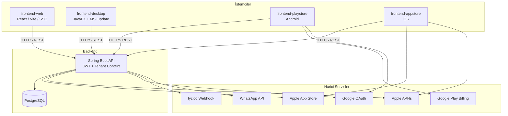

# Pusula Service Ecosystem

**Pusula**, iklimlendirme ve teknik servis firmaları için geliştirilmiş, çok kiracılı (multi-tenant) bir SaaS platformudur. Tek bir backend üzerinden saha operasyonları, stok ve finans yönetimi, abonelik/plan kontrolü ve merkezi super-admin operasyonlarını bir arada sunar.

> **Diller:** [English](README.md) · Türkçe (bu dosya)

| Bileşen | Teknoloji | Açıklama |
|---------|-----------|----------|
| **Backend API** | Spring Boot 3 · Java 17 · PostgreSQL | REST API, JWT auth, tenant izolasyonu |
| **Web (Marketing)** | React 19 · Vite · Tailwind CSS | Kurumsal site, yerel SEO landing’ler, SSG prerender |
| **Desktop** | JavaFX 21 · Java 21 | Ofis / dispatch yönetimi (Windows), MSI otomatik güncelleme |
| **Android** | Kotlin · Jetpack Compose · Hilt | Google Play saha ve admin mobil uygulaması |
| **iOS** | SwiftUI · StoreKit · APNs | App Store mobil uygulaması, push bildirimleri |

---

## İçindekiler

- [Özellikler](#özellikler)
- [Mimari](#mimari)
- [Depo Yapısı](#depo-yapısı)
- [Gereksinimler](#gereksinimler)
- [Hızlı Başlangıç](#hızlı-başlangıç)
- [Ortam Değişkenleri](#ortam-değişkenleri)
- [Veritabanı Migrasyonları](#veritabanı-migrasyonları)
- [Testler](#testler)
- [Production Dağıtımı](#production-dağıtımı)
- [Güvenlik](#güvenlik)
- [API Özeti](#api-özeti)
- [İlgili Dokümantasyon](#ilgili-dokümantasyon)

---

## Özellikler

### Operasyonel
- Servis iş emirleri (atama, durum takibi, saha fotoğrafları, imza)
- Servis faturalama (satış) ile tahsilat tutarlarının ayrılması; geriye dönük tamamlama desteği
- Barkod ile stok / parça okuma
- Araç stoğu ve envanter yönetimi
- Teklif (proposal) oluşturma ve PDF çıktıları
- Müşteri ve cari hesap yönetimi (satış / tahsilat sınıflandırması)
- Şirket borç takibi (tarihli ödemeler ve ekleme geçmişi)
- İş varlıkları (business assets) takibi ve değerleme raporları
- Finans raporları: kârlılık ↔ nakit akışı ayrımı, açık borç / cari ihracı, aylık PDF raporlar
- Admin dashboard (KPI, teknisyen performansı, kota, saha radarı)

### Platform
- **Multi-tenant mimari:** Her şirket (`company`) kendi verisiyle izole çalışır; JWT üzerinden tenant context otomatik set edilir (araç ve stok mutasyon izolasyonu dahil).
- **Rol tabanlı erişim:** `SUPER_ADMIN`, `COMPANY_ADMIN`, `TECHNICIAN` ve super-admin alt rolleri.
- **Abonelik & kota:** Plan bazlı özellik kapıları (feature gate) ve kullanım kotaları.
- **Google Play abonelik doğrulama:** `POST /api/subscription/google-verify`
- **App Store abonelik doğrulama:** `POST /api/subscription/apple-verify`
- **iOS APNs push:** Kayıtlı cihazlara iş emri atama bildirimleri (`/api/push-devices`)
- **Ödeme webhook altyapısı:** Iyzico webhook imza doğrulama (opsiyonel / gelecek uyumlu).
- **Super-admin operasyon paneli:** Şirket yönetimi, kota durumu, diagnostic paketleri, operations dashboard.

### İstemciler
- **Desktop:** Tam operasyon yönetimi, Retrofit tabanlı API entegrasyonu, modern UI / dark theme, finans ve iş varlıkları sekmeleri, MSI otomatik güncelleme (sürüm: `frontend-desktop/src/main/resources/app-version.properties`).
- **Android / iOS:** Saha teknisyeni ve şirket admin akışları, Google / Apple oturum açma, in-app purchase (Play Billing / StoreKit).
- **Web:** Halka açık tanıtım sitesi; yerel SEO landing sayfaları, fiyat listesi, yetkili markalar, iletişim formu, gizlilik/şartlar ve public route’lar için SSG prerender.

---

## Mimari


```mermaid
flowchart TB
    subgraph clients [İstemciler]
        WEB[frontend-web<br/>React / Vite / SSG]
        DESK[frontend-desktop<br/>JavaFX + MSI update]
        AND[frontend-playstore<br/>Android]
        IOS[frontend-appstore<br/>iOS]
    end

    subgraph backend [Backend]
        API[Spring Boot API<br/>JWT + Tenant Context]
        DB[(PostgreSQL)]
    end

    subgraph external [Harici Servisler]
        GP[Google Play Billing]
        AS[Apple App Store]
        APNS[Apple APNs]
        GAuth[Google OAuth]
        IYZ[Iyzico Webhook]
        WA[WhatsApp API]
    end

    WEB -->|HTTPS REST| API
    DESK -->|HTTPS REST| API
    AND -->|HTTPS REST| API
    IOS -->|HTTPS REST| API

    API --> DB
    AND --> GP
    IOS --> AS
    IOS --> APNS
    API --> AS
    API --> APNS
    AND --> GAuth
    API --> GAuth
    API --> IYZ
    API --> WA
```

**Kimlik doğrulama akışı:** İstemci `POST /api/auth/login` ile JWT alır. Sonraki isteklerde `Authorization: Bearer <token>` header'ı kullanılır. `TenantInterceptor`, token'dan company ID'yi çıkarıp `TenantContext`'e yazar.

---

## Depo Yapısı

```
Pusula-SaaS-Ecosystem/
├── backend/                    # Spring Boot REST API
│   ├── src/main/java/          # Controller, service, entity, DTO
│   ├── src/main/resources/     # application*.properties, schema.sql, V2–V18 migrasyonları
│   ├── src/test/               # JUnit regression testleri
│   ├── deploy_vps_staging.sh   # VPS deployment helper
│   └── .env.example            # Backend env şablonu
├── frontend-web/               # Marketing / kurumsal web sitesi (Vercel + SSG)
├── frontend-desktop/           # JavaFX masaüstü uygulaması (Windows / MSI)
├── frontend-playstore/         # Android (Google Play) uygulaması
│   └── PusulaService/
├── frontend-appstore/          # iOS (App Store) uygulaması
│   └── PusulaService/
├── scripts/                    # Yardımcı scriptler (ör. Play Store asset)
├── RUNBOOK.md                  # Production rollout checklist
├── README.md                   # İngilizce dokümantasyon
└── README.tr.md                # Türkçe dokümantasyon (bu dosya)
```

> **Not:** Super-admin web paneli (`Pusula-Super-Admin-Panel`) bu depoda değil; ayrı bir proje olarak yönetilir. Detaylar için `RUNBOOK.md` dosyasına bakın.

---

## Gereksinimler

| Araç | Sürüm | Kullanım |
|------|-------|----------|
| **Java (JDK)** | 17 | Backend |
| **Java (JDK)** | 21 | Desktop (JavaFX) |
| **Maven** | 3.8+ | Backend & Desktop build |
| **PostgreSQL** | 14+ | Veritabanı |
| **Node.js** | 18+ | Web frontend |
| **Android Studio** | Latest | Android geliştirme |
| **Xcode** | 15+ | iOS geliştirme |

---

## Hızlı Başlangıç

### 1. Backend

```bash
# PostgreSQL'de veritabanı oluşturun
createdb pusula_db

# Ortam değişkenlerini ayarlayın (örnek dosyayı kopyalayın)
cp backend/.env.example backend/.env
# backend/.env içinde DB_PASSWORD ve JWT_SECRET değerlerini doldurun

# Derleme ve çalıştırma
cd backend
mvn spring-boot:run
```

- **Local port:** `8081` (`application.properties`)
- **VPS profili:** `spring.profiles.active=vps` ile `application-vps.properties` devreye girer (port `8080`)
- **Auth endpoint'leri:** `/api/auth/*`

### 2. Web Sitesi (`frontend-web`)

```bash
cd frontend-web
cp .env.example .env
npm install
npm run dev
```

- **Dev server:** Vite default (`http://localhost:5173`)
- **Production build:** `npm run build` Vite client build, SSR build ve ardından `scripts/prerender.mjs` (public route SSG) çalıştırır → `dist/` Vercel veya statik hosting’e deploy edilir
- **SPA routing:** `vercel.json` rewrite kuralları ile yapılandırılmıştır

### 3. Desktop Uygulaması (`frontend-desktop`)

```bash
cd frontend-desktop
mvn javafx:run
```

Alternatif olarak IDE'den `com.pusula.desktop.Launcher` main class'ını çalıştırın.

- **API base URL:** `RetrofitClient.BASE_URL` (production: `https://api.pusulaiklimlendirme.com/`)
- **Uygulama sürümü:** `frontend-desktop/src/main/resources/app-version.properties`
- **Otomatik güncelleme:** desktop `/api/public/desktop-version` ile kontrol eder ve MSI güncellemesi uygular
- **Windows installer çıktıları:** `frontend-desktop/installer/Output/` (gitignore'da)

### 4. Android Uygulaması (`frontend-playstore`)

`frontend-playstore/PusulaService/local.properties` dosyasını oluşturun (**bu dosya repoya commit edilmez**):

```properties
# API
debug.api.base.url=https://api.pusulaiklimlendirme.com
release.api.base.url=https://api.pusulaiklimlendirme.com

# Google Sign-In
google.web.client.id=YOUR_GOOGLE_WEB_CLIENT_ID

# Release imzalama (Play Store yükleme için)
release.keystore.path=keystore/upload-keystore.jks
release.keystore.password=YOUR_KEYSTORE_PASSWORD
release.key.alias=upload
release.key.password=YOUR_KEY_PASSWORD
```

```bash
cd frontend-playstore/PusulaService
./gradlew assembleDebug        # Debug APK
./gradlew assembleRelease      # Release APK (imzalama yapılandırılmışsa)
```

- **Application ID:** `com.pusula.service`
- **Min SDK:** 26 · **Target SDK:** 35

### 5. iOS Uygulaması (`frontend-appstore`)

1. `frontend-appstore/PusulaService/` dizinini Xcode ile açın (`PusulaService.xcodeproj`).
2. API base URL: `Services/NetworkManager.swift`
3. StoreKit entegrasyonu: `Services/StoreKitManager.swift`
4. Push bildirimleri: **Push Notifications (APNs)** capability’yi etkinleştirin; cihaz kaydı `/api/push-devices` üzerinden yapılır.
5. Signing & capabilities’i Apple Developer hesabınızla yapılandırın.
6. Cihaz testi notları için `frontend-appstore/REAL_DEVICE_TEST_PLAN.md` dosyasına bakın.

---

## Ortam Değişkenleri

### Backend (Production — zorunlu)

| Değişken | Açıklama |
|----------|----------|
| `DB_PASSWORD` | PostgreSQL şifresi |
| `JWT_SECRET` | JWT imzalama anahtarı (64+ karakter önerilir) |
| `GOOGLE_WEB_CLIENT_ID` | Google OAuth web client ID |
| `GOOGLE_PLAY_PACKAGE_NAME` | Android paket adı |
| `GOOGLE_PLAY_API_ACCESS_TOKEN` | Google Play Developer API erişim token'ı |
| `IYZICO_WEBHOOK_SECRET` | Iyzico webhook imza doğrulama |
| `APP_DEPLOY_VERSION` | Deploy sürüm etiketi (ör. `2026.06.13-1`) |

### Backend — App Store & APNs

| Değişken | Açıklama |
|----------|----------|
| `APPLE_APP_STORE_BUNDLE_ID` | App Store bundle ID (varsayılan: `com.pusula.service`) |
| `APPLE_APP_STORE_APP_APPLE_ID` | Sayısal App Store Apple ID |
| `APPLE_APP_STORE_ENVIRONMENTS` | Doğrulama ortamları (varsayılan: `SANDBOX,PRODUCTION`) |
| `APPLE_APP_STORE_ROOT_CERTIFICATE_PATHS` | Apple kök sertifika yolları (virgülle ayrılmış) |
| `APPLE_APP_STORE_ENABLE_ONLINE_CHECKS` | Online App Store kontrolleri (varsayılan: `true`) |
| `APPLE_PUSH_ENABLED` | APNs push gönderimini aç/kapa (varsayılan: `false`) |
| `APPLE_PUSH_KEY_PATH` | APNs `.p8` auth key yolu |
| `APPLE_PUSH_KEY_ID` | APNs key ID |
| `APPLE_PUSH_TEAM_ID` | Apple Developer Team ID |
| `APPLE_PUSH_BUNDLE_ID` | Push topic / bundle ID (varsayılan: `com.pusula.service`) |
| `PUSH_TOKEN_ENCRYPTION_KEY` | Push token şifreleme için Base64 32-byte AES anahtarı |

### Backend (Opsiyonel)

| Değişken | Açıklama |
|----------|----------|
| `WHATSAPP_API_TOKEN` | WhatsApp bildirim API token |
| `WHATSAPP_PHONE_ID` | WhatsApp phone number ID |
| `IYZICO_API_KEY` / `IYZICO_API_SECRET` | Iyzico ödeme (sandbox varsayılanları dev için) |
| `IYZICO_BASE_URL` / `IYZICO_CALLBACK_URL` | Iyzico API tabanı ve webhook callback URL |
| `APP_BUSINESS_TIMEZONE` | İş saatleri timezone (varsayılan: `Europe/Istanbul`) |

Şablon dosyalar: `backend/.env.example`, `backend/src/main/resources/application.properties`, `backend/src/main/resources/application-vps.properties`

### Web

| Değişken | Açıklama |
|----------|----------|
| `VITE_API_BASE_URL` | Backend API URL |
| `VITE_COMPANY_ID` | İletişim formu tenant ID |

Şablon: `frontend-web/.env.example`

---

## Veritabanı Migrasyonları

SQL migration dosyaları `backend/src/main/resources/` altında:

| Dosya | Açıklama |
|-------|----------|
| `schema.sql` | Temel şema tanımı |
| `V2__saas_plans_and_features.sql` | SaaS planları, özellikler ve kullanım takibi |
| `V3__inventory_barcode.sql` | Envanter barkod kolonu |
| `V4__production_readiness.sql` | Süresi dolmuş abonelik read-only, plan seed, indexler |
| `V5__backfill_missing_org_codes.sql` | Eksik org code backfill |
| `V6__super_admin_global_tenant_support.sql` | Super-admin global tenant desteği |
| `V7__app_store_subscription_verification.sql` | App Store abonelik doğrulama / ownership hash |
| `V8__ios_apns_push_devices.sql` | iOS APNs push cihaz kayıt tablosu |
| `V9__service_ticket_completion_and_collection_dates.sql` | Tamamlanma ve tahsilat iş tarihleri |
| `V10__ticket_pricing_and_cost_snapshots.sql` | Satış / tahsilat fiyat snapshot’ları |
| `V11__service_expense_business_dates.sql` | Servis gideri iş tarihleri ve finans bağlantısı |
| `V12__company_debt_payment_history.sql` | Şirket borç ödeme geçmişi |
| `V13__current_account_payment_classification.sql` | Cari tahsilat sınıflandırması |
| `V14__expense_financial_treatment.sql` | Gider finansal sınıflandırması |
| `V15__company_debt_addition_history.sql` | Şirket borç ekleme geçmişi |
| `V16__current_account_optimistic_lock.sql` | Cari hesap optimistic locking |
| `V17__inventory_critical_level_not_null.sql` | Envanter kritik seviye NOT NULL |
| `V18__business_assets.sql` | İş varlıkları takibi |

Production'da deploy öncesi bu dosyaların uygulandığından emin olun. JPA `ddl-auto=update` dev ortamında şemayı otomatik günceller; production'da kontrollü migration tercih edilmelidir.

Numaralı dizinin dışında kalan manuel yardımcılar: `backend/src/main/resources/db/manual/`.

---

## Testler

```bash
cd backend
mvn test
```

Kapsanan alanlar:
- Auth rate limiting ve JWT yönetimi
- Payment webhook güvenliği ve provider izolasyonu
- Google Play / App Store verify idempotency ve yenilemeler
- APNs push listener / cihaz kayıt davranışı
- Super-admin validation & audit
- Feature/quota tutarlılığı
- Tenant izolasyonu (ör. araçlar) ve stok mutasyon güvenliği
- Finans / rapor semantiği (fiyat snapshot, cari sınıflandırma, açık bakiyeler)

---

## Production Dağıtımı

### Backend (VPS)

```bash
export DB_PASSWORD='...'
export JWT_SECRET='...'
export GOOGLE_WEB_CLIENT_ID='...'
# Diğer production env'ler (Play, App Store, APNs, Iyzico)...

cd backend
bash deploy_vps_staging.sh
```

Spring profili: `-Dspring.profiles.active=vps`

### Web (Vercel)

`frontend-web` dizinini Vercel'e bağlayın. Build command: `npm run build` (SSG prerender dahil), output: `dist`.

### Mobil

- **Android:** Release APK/AAB → Google Play Console
- **iOS:** Archive → App Store Connect (API tarafında APNs key ve App Store doğrulama env’lerinin ayarlı olduğundan emin olun)

Deploy sonrası smoke test planı için **[`RUNBOOK.md`](RUNBOOK.md)** dosyasına bakın.

---

## Güvenlik

- JWT secret, DB şifresi, APNs anahtarları ve imzalama anahtarları **asla** repoya commit edilmemelidir.
- `.gitignore` kapsamı: `.env`, `local.properties`, `*.jks`, `keystore/`, `backend/scripts/` (mock data).
- Production'da sandbox Iyzico fallback değerlerine güvenmeyin; tüm secret'ları env üzerinden sağlayın.
- `PUSH_TOKEN_ENCRYPTION_KEY` yapılandırıldığında push cihaz token’ları at-rest şifrelenir.
- Android HTTP log'larında `SensitiveHttpLogRedactor` token ve şifre alanlarını maskeler.
- Stok mutasyonları ve araç erişimi backend’de tenant kapsamındadır.

---

## API Özeti

| Prefix | Açıklama |
|--------|----------|
| `/api/auth` | Login, register, Google auth |
| `/api/tickets` | Servis iş emirleri (complete / signature dahil) |
| `/api/inventory` | Stok yönetimi |
| `/api/finance` | Finans işlemleri |
| `/api/current-accounts` | Cari hesap yönetimi |
| `/api/company-debts` | Şirket borç takibi |
| `/api/business-assets` | İş varlıkları takibi |
| `/api/admin` | Şirket admin dashboard |
| `/api/superadmin` | Super-admin operasyonları |
| `/api/subscription` | Planlar, Google Play verify, App Store verify |
| `/api/payment` | Ödeme & webhook |
| `/api/push-devices` | Mobil push cihaz kaydı (APNs) |
| `/api/reports` | Raporlama (kârlılık, nakit akışı, açık borç vb.) |
| `/api/public` | Kimlik doğrulama gerektirmeyen endpoint'ler |
| `/api/public/desktop-version` | Desktop MSI otomatik güncelleme sürüm kontrolü |

---

## İlgili Dokümantasyon

- [`README.md`](README.md) — English documentation
- [`RUNBOOK.md`](RUNBOOK.md) — Production deploy checklist, smoke test planı, env referansları
- [`frontend-appstore/REAL_DEVICE_TEST_PLAN.md`](frontend-appstore/REAL_DEVICE_TEST_PLAN.md) — iOS gerçek cihaz test planı
- [`scripts/`](scripts/) — Play Store asset üretim yardımcıları

---

## Lisans

Bu proje özel (private) bir SaaS ekosistemidir. Dağıtım ve kullanım hakları proje sahibine aittir.

## İletişim

- **Web:** [pusulaiklimlendirme.com](https://pusulaiklimlendirme.com)
- **E-posta:** pusulaiklimlendirme.didim@gmail.com
- **GitHub:** [emirrkls/Pusula-SaaS-Ecosystem](https://github.com/emirrkls/Pusula-SaaS-Ecosystem)
